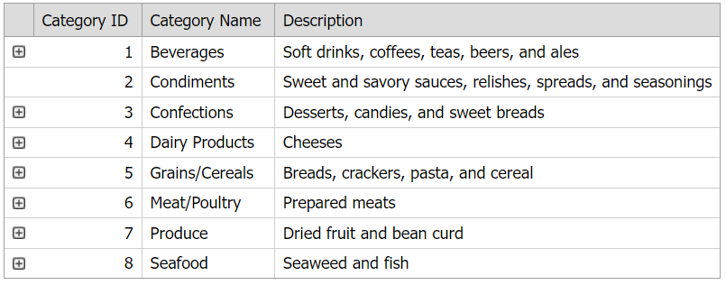

<!-- default badges list -->

[](https://supportcenter.devexpress.com/ticket/details/E2537)
[](https://docs.devexpress.com/GeneralInformation/403183)
[](#does-this-example-address-your-development-requirementsobjectives)
<!-- default badges end -->
# Grid View for ASP.NET Web Forms - How to hide the detail button when the detail grid is empty

This example demonstrates how to handle the grid's `DetailRowGetButtonVisibility` event to hide the detail button for empty detail rows.



## Overview

Create a master grid control, set its [ShowDetailRow](https://docs.devexpress.com/AspNet/DevExpress.Web.ASPxGridViewDetailSettings.ShowDetailRow) property to `true`, specify the grid's [Templates.DetailRow](https://docs.devexpress.com/AspNet/DevExpress.Web.GridViewTemplates.DetailRow) property, and add a detail grid to the template.

```aspx
<dx:ASPxGridView ID="mainGrid" runat="server" AutoGenerateColumns="False" DataSourceID="masterDataSource"
    KeyFieldName="CategoryID" OnDataBinding="masterGrid_DataBinding"
    OnDetailRowGetButtonVisibility="masterGrid_DetailRowGetButtonVisibility">
    <Templates>
        <DetailRow>
            <dx:ASPxGridView ID="detailGrid" runat="server" KeyFieldName="ProductID" DataSourceID="dsDetail"
                AutoGenerateColumns="False" OnBeforePerformDataSelect="detailGrid_BeforePerformDataSelect" >
                <!-- ... -->
            </dx:ASPxGridView>
        </DetailRow>
    </Templates>
    <Columns>
        <!-- ... -->
    </Columns>
    <SettingsDetail ShowDetailRow="True" />
</dx:ASPxGridView>
```

Handle the master grid's server-side [DataBinding](https://learn.microsoft.com/en-us/dotnet/api/system.web.ui.control.databinding?view=netframework-4.8.1) event. In the handler, create a select command and check whether the detail data source contains the corresponding fields. Save the resulting rows to the session (**SelectResult**).

```cs
protected void masterGrid_DataBinding (object sender, EventArgs e) {
    DoSelect(masterDataSource.DataFile);
}
private void DoSelect (string connectionString) {
    DataView selectResult = new DataView();
    string selectCommand = "select distinct [CategoryID] from [Products]";
    using (AccessDataSource ds = new AccessDataSource(connectionString, selectCommand)) {
        selectResult = (DataView)ds.Select(DataSourceSelectArguments.Empty);
    }
    ArrayList result = new ArrayList();
    foreach (DataRow row in selectResult.Table.Rows)
        result.Add(row["CategoryID"]);
    Session["SelectResult"] = result;
}
```

Handle the grid's server-side [DetailRowGetButtonVisibility](https://docs.devexpress.com/AspNet/DevExpress.Web.ASPxGridView.DetailRowGetButtonVisibility) event. Based on the row's key value, determine whether the corresponding detail row is empty and set the [e.ButtonState](https://docs.devexpress.com/AspNet/DevExpress.Web.ASPxGridViewDetailRowButtonEventArgs.ButtonState) argument property to `Hidden` to hide the detail button dor empty detail rows.

```cs
protected void masterGrid_DetailRowGetButtonVisibility (object sender, ASPxGridViewDetailRowButtonEventArgs e) {
    if (!((ArrayList)Session["SelectResult"]).Contains(e.KeyValue))
        e.ButtonState = GridViewDetailRowButtonState.Hidden;
}
```

## Files to Review

* [Default.aspx](./CS/Default.aspx) (VB: [Default.aspx](./VB/Default.aspx))
* [Default.aspx.cs](./CS/Default.aspx.cs) (VB: [Default.aspx.vb](./VB/Default.aspx.vb))
<!-- feedback -->
## Does this example address your development requirements/objectives?

[](https://www.devexpress.com/support/examples/survey.xml?utm_source=github&utm_campaign=asp-net-web-forms-grid-hide-detail-button-for-empty-detail-rows&~~~was_helpful=yes) [](https://www.devexpress.com/support/examples/survey.xml?utm_source=github&utm_campaign=asp-net-web-forms-grid-hide-detail-button-for-empty-detail-rows&~~~was_helpful=no)

(you will be redirected to DevExpress.com to submit your response)
<!-- feedback end -->
